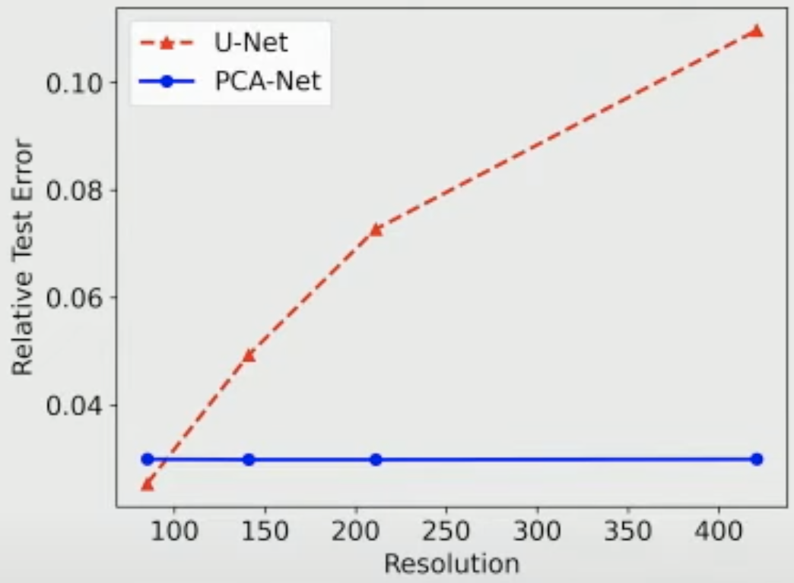
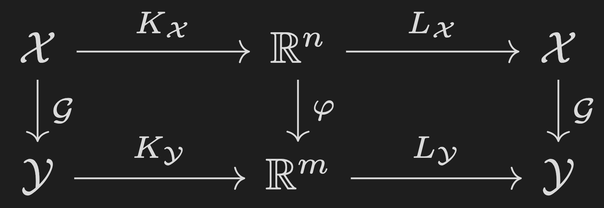
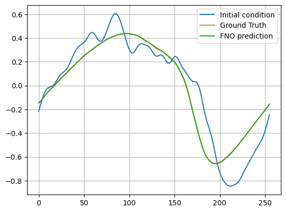
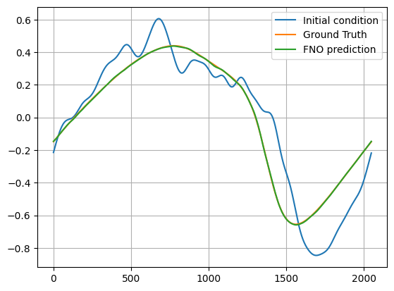

# Class 12 — 11/07/2025

**Presenter:** Pedro Paulo

**Topic:** Neural operators (FNO, Galerkin Transformer); large-scale surrogates

# Foundations of Neural Operators

## Notations and definitions
Let's start by setting up some notations:
- ‎Derivatives $\dfrac{\partial}{\partial t}$ are going to be written as $\partial_t$, and, in the case of derivatives **w.r.t. time**, they could be written as $\partial_t x=\dot x$.
- ‎Integrals $\int \{\cdot\} \ \mathrm dt$ are going to be written as $\int \mathrm dt \ \{\cdot\}$.

And having some definitions:
- ‎**Vectors** are *lists of numbers*, i.e., a vector $v$ lives in $\mathbb R^{d_v}$, and can be thought as a list of $d_v$ numbers, all in $\mathbb R$. More generally, vectors could live in a generic *vector space* $V$, so we would have $v\in V$. 
- ‎**Functions** are vector-to-vector mapping, i.e., a function $f$ brings a $v \in \mathbb R^{d_v}$ to a $w \in \mathbb R^{d_w}$, and we define that as $f: \mathbb R^{d_v} \rightarrow \mathbb R^{d_w}$.  More generally, functions could operate on a generic *vector space* $V$ and $W$, so we would have $f: V \rightarrow W$. 
- ‎**Operators** are function-to-functions mapping, i.e., an operator $A$ brings an $f:\mathbb R^{d_{v1}} \rightarrow \mathbb R^{d_{w1}}$ to a $g: \mathbb R^{d_{v2}} \rightarrow \mathbb R^{d_{w2}}$. More generally, operators could operate on generic *function spaces*, so we would have an operator $A$ bringing an $f:V_1 \rightarrow W_1$ to a $g:V_2 \rightarrow W_2$. 

Key differences:
- ‎A vector is *naturally* discrete. Therefore, the input-output pair for functions are also *naturally* discrete. 
- ‎A function is *naturally* continuous. Therefore, the input-output pair for operators are also *naturally* continuous.

It is said that Neural Networks (NN) are **universal function approximators** [1,2], in this section we're going to create the idea of **universal operator approximators**, that map functions to functions, using something called **Neural Operators**.

A NN $\mathcal N$ can be thought as a general **function** $\mathcal N: X \times \Theta \rightarrow Y$, where $X$ and $Y$ are vector spaces, and $\Theta$ is the parameter space. So we take elements $x \in X$ and we *learn* how to map those onto $y\in Y$, by means of changing the parameters $\theta \in \Theta$. That way, we can approximate any function (that's where the "universal function approximator" comes from) that maps $X \rightarrow Y$. 
In a similar way we can think about a Neural Operator $\mathcal G^\dagger: \mathcal X \times \Theta \rightarrow \mathcal Y$, where $\mathcal X$ and $\mathcal Y$ are function spaces, and $\Theta$ is the parameter space. Now, instead of learning how to map *vectors*, we're going to learn the mapping of *functions*. This general idea will be expanded further.

**Why are functions important?** Everything in the real world is a function! If we want to predict the airflow around a car, the stress caused by deforming a metal bar, the temperature of a reactor, the weather (and the list goes on), we would need to use functions.
When putting into a computer we are going to need to mesh our function, otherwise we'd not be able to process it. But we're going to think about functions when designing the architecture of these Neural Operators.

**Why approximate operators?** Let's start with a parallel with image processing. Imagine that I have a Convolutional NN (CNN) that take as an input a (discrete) $256\times256$ image (let's imagine it in grayscale for simplicity). The input to this CNN would then be a $v \in \mathbb R^{256 \times 256}$, where each element $v_i \in \mathbb R \ ; v_i \in [0,1]$. Although this is a typical architecture for image processing [3], and it has been around since 1989 [4], it has a couple of limitations:
- ‎The input **has to** be $256\times256$, the need of different dimension leads to a new NN and a new training.
- ‎In case of regression, the output **has to** a fixed dimension, the need of different dimension leads to a new NN and a new training.
For the case of image processing, where there's no trivial underlying function behind the image, we cannot take advantage of the use of Neural Operators, but in the case of distributions of physical quantities, e.g., temperature, where there's a underlying function behind it, we can leverage the use of Neural Operators to understand distribution function, and make predictions/controls based on it, decoupling the parametrization $\Theta$ from the discretization of the data. [5] *et al.* compared the errors of two networks: U-Net (NN topology) and PCA-Net (Neural operator topology), that were trained on different discretizations of the *same underlying function*, and the result is shown below:



This brings a concept (that we'll try to keep with our definition of Neural Operators) called **Discretization Invariance**:
- ‎When we have Discretization Invariance we de-couple the parameters and the cost from the discretization, i.e., when changing the discretization the error doesn't vary.
- ‎If our model is Discretization Invariable, we can use information at different discretizations to train, and we can transfer parameters learned for one discretization to another, that leads to something called "zero-shot super-resolution", that basically consists of training into a smaller discretization and predicting into a bigger one, due to the Discretization Invariance. This concept, together with its limitations, will be discussed in the "Fourier Neural Operator" section.
 
# Operator basics
Let the operator $\mathcal G: \mathcal X \rightarrow \mathcal Y$, where $\mathcal X$ and  are separable Banach spaces (mathematical way of saying that $\mathcal X$ and $\mathcal Y$ are spaces of functions) of vector-valued functions:
```math
\begin{align}
\mathcal X=\{x: D\rightarrow \mathbb R\}, \ \ \ D \subseteq\mathbb R^d
\\
\mathcal Y=\{y: D\rightarrow \mathbb R\}
\end{align}
```
For example, $D$ is a cut plane of a biological tissue ($D \subseteq\mathbb R^2$) under the application of electric fields, and $x\in\mathcal X$ and $y\in\mathcal Y$ are temperatures before and after the application of said fields. The operator $\mathcal G$ is given by:
```math
\rho c_p\partial_tT =\nabla \cdot(k\nabla T) + \sigma|E|^2-Q
```
where
```math
\begin{align}
\rho \text{ is the tissue's density}
\\
c_p \text{ is the tissue's heat capacity}
\\
T \text{ is the temperature distribution on the tissue}
\\
k \text{ is the tissue's thermal conductivity}
\\
\sigma \text{ is the tissue's electrical conductivity}
\\
E \text{ is the electric field distribution}
\\
Q \text{ is the heat transfer, from blood/metabolism}
\end{align}
```
This is one specific case of an operator, but any PDE can be thought as an operator.

## Approximations

Imagine that I want to approximate this operator $\mathcal G$ by means of an $\mathcal G^\dagger: \mathcal X\times\Theta \rightarrow \mathcal Y$, a first idea could be to find two linear mappings, here called $K_\mathcal W$ and $L_\mathcal W$ such that $K_\mathcal WL_\mathcal W \approx I$, where $I$ is the identity operator (i.e., by applying $K_\mathcal W$ and $L_\mathcal W$ to *all* $w \in \mathcal W$ we will return to the same $w$), and that by applying $K_\mathcal W$ to a $w\in\mathcal W$ we can project this $w$ onto a non-infinite space $\mathbb R^{d_\mathcal W}$ (one example of such operator is the FFT family, we're we approximate every function to a finite set of coefficients that represent the original functions' sines and cosines). By doing this to both $\mathcal X$ and $\mathcal Y$, we're going to have two non-infinite representations of $\mathcal X$ and $\mathcal Y$, on $\mathbb R^{n}$ and $\mathbb R^{m}$, respectively, and we can map this two representations using a non-linear function $\varphi$. 

A general diagram is shown below:




In this case, we can see that our $\mathcal G^\dagger$ can be given by $\mathcal G^\dagger = K_\mathcal X \circ \varphi\circ L_\mathcal Y$, where $K_\mathcal X$ and $L_\mathcal Y$ are the operators that project $\mathcal X$ and $\mathcal Y$ to the non-infinite dimension spaces $\mathbb R^{n}$ and $\mathbb R^{n}$, respectively, and $\varphi$ is a non-linear function that maps $\mathbb R^{n}$ to $\mathbb R^{m}$. Different selections of the set {$K_\mathcal W$, $L_\mathcal W$, $\varphi$} generate different classes of Neural Operators.

We can, from this, see the first limitation of this technique: we're limited by how well is the approximation of $K_\mathcal WL_\mathcal W \approx I$. It turns out that, as described by [5], this is approximation is fairly general:
Universal approximation:
Let:
- ‎ $\mathcal X$ and $\mathcal Y$ be separable Banach spaces.
- ‎ $\mathcal G: \mathcal X \rightarrow \mathcal Y$ be continuous.
For any $U\subset \mathcal X$ compact and $\epsilon > 0$, *there exists* continuous, linear maps $K_\mathcal X:\mathcal X \rightarrow \mathbb R^n$,  $L_\mathcal Y:\mathcal Y \rightarrow \mathbb R^m$, and $\varphi: \mathbb R^n \rightarrow \mathbb R^m$ such that:
```math
\sup_{u\in U} \| \mathcal G(u)-\mathcal G^\dagger(u)\|_\mathcal Y < \epsilon
```
Average approximation:
Let: 
- ‎ $\mathcal X$ be separable Banach spaces, and $\mu \in \mathcal P(\mathcal X)$ be a probability measure in $\mathcal X$.
- ‎ $\mathcal G \in L_\mu^p(\mathcal X;\mathcal Y)$ for some $1\leq p < \infty$
If $\mathcal Y$ is separable Hilbert space, and $\epsilon > 0$, *there exists* continuous, linear maps $K_\mathcal X:\mathcal X \rightarrow \mathbb R^n$,  $L_\mathcal Y:\mathcal Y \rightarrow \mathbb R^m$, and $\varphi: \mathbb R^n \rightarrow \mathbb R^m$ such that:
```math
\| \mathcal G(u)-\mathcal G^\dagger(u)\|_{L_\mu^p(\mathcal X;\mathcal Y)} < \epsilon
```
Let's start by giving two classes of Neural Operators, the Principal Component Analysis Network (PCA-NET) and the Deep Operator Network (DeepONet).

## PCA
First proposed by [6], we're going to define the PCA-NET approximation by analyzing our input and output spaces using a PCA-like technique.
Let:
- ‎$\mathcal X$ and $\mathcal Y$ be separable Banach spaces, and let $x\in K\subset\mathcal X$, with $K$ compact.
- ‎$\mathcal G$ (the operator that we're trying to approximate) be continuous.
- ‎$\varphi_j:\mathbb R^n \times \Theta \rightarrow \mathbb R^m$ be multiple neural networks.
- ‎$\xi_1,\text{...},\xi_n$ be the PCA basis functions of the input space $\mathcal X$. The operator $K_\mathcal X$ for a given $x\in \mathcal X$ would then be $K_\mathcal X(x) :=\mathrm Lx = \{\langle\xi_j,x\rangle\}_j$.
- ‎$\psi_1,\text{...},\psi_m$ be the PCA basis functions of the output space $\mathcal Y$.

The final approximation $\mathcal G^\dagger_{\text{PCA}}:\mathcal X \times \Theta \rightarrow \mathcal Y$ is then given by:
```math
\begin{align}
\mathcal{G}^\dagger_{\text{PCA}}&(x;\theta)(u)=\sum_{j=0}^m\varphi_j(\mathrm Lx;\theta)\psi_j(u) \ \ \ \ \forall\ x\in\mathcal X  \ \ \ \ u\in D_u
\end{align}
```
That is, the output is the *linear combination* of the PCA output basis functions {$\psi_j$}, weighted by NN coefficients $\varphi_j$, that have as input the $\mathrm Lx$ mapping of the input to the PCA space.

## DeepONet
Proposed by [7], the DeepONet generalizes the idea of PCA-NET, by means of *learning* the PCA basis functions of the output space $\mathcal Y$, i.e., $\psi_1,...,\psi_m$ are now NNs. The parameter space is then composed of two distinct set of parameters to be learned: $\theta_\varphi$, the same parameters as the original PCA-NET, and $\theta_\psi$, the parameters for the PCA basis functions of the output space. We will then have:

```math
\begin{align}
\mathcal G^\dagger_{\text{DeepONet}}&(x;\theta)(u)=\sum_{j=0}^m\varphi_j(\mathrm Lx;\theta_\varphi)\psi_j(u;\theta_\psi) \ \ \ \ \forall\ x\in\mathcal X  \ \ \ \ u\in D_u
\end{align}
```

## Overcoming the curse of dimensionality
One of the big problems of these approaches is the fact $L_\mathcal Y$ is a linear combination of the {$\psi_j$}. This leads to the need of an doubly exponential growth in the amount of data, when compared to $n$ (the size of the PCA basis functions of the input space $\mathcal X$), to achieve convergence [8]. To overcome this difficulty, we're going to generalize this idea of linear approximation of operators to the non-linear case.

Let:
- ‎$\mathcal X$ and $\mathcal Y$ be function spaces over $\Omega \subset \mathbb R^d$
- ‎$\mathcal G^\dagger$ is the composition of non-linear operators: $\mathcal G^\dagger=S_1\circ \text{...} \circ S_L$. In the linear case, as described before, $S_1 = K_\mathcal X$, $S_L = K_\mathcal Y$ and they're connected through multiple $\varphi_j$.
The above definition *looks a lot* like the typical definition of NNs, where each one of the $S_l$ is a layer of your NN. And, as we're going to see, it is! At least it is a generalization of the definition of NN to function space.
[9] proposed to create each one of this $S_l$ as follows:
```math
S_l(a)(x) = \sigma_l\bigg( W_la(x) + b_l + \int_\Omega\mathrm dz \ \kappa_l(x,z)a(z)  \bigg), \ \ \ \ x \in \Omega
```
where:
- ‎$\sigma_l:\mathbb R^k\rightarrow\mathbb R^k$ is the non-linear activation function.
- ‎$W_l\in\mathbb R^k$ is a term related to a "residual network". This term is not necessary for convergence, but it's credited to help with convergence speed.
- ‎$b_l\in\mathbb R^k$ is the bias term.
- ‎$\kappa_l:\Omega\times\Omega\rightarrow\mathbb R^k$ is the kernel function.

The main distinction between this approach and the traditional NN approach is the $\kappa_l$ term, instead of the traditional weights, and the fact that the input $a(x)$ is a *function*, instead of a vector like the traditional NNs.
Different selections of $\kappa_l$ generate different classes of these non-linear Neural Operators, but we're going to focus on the transform $\kappa_l$, more specifically the Fourier Neural Operator and the Garlekin Transformer.

# Fourier Neural Operator
Let $\kappa_l(x,z)=\kappa_l(x-z)$, the integral will then become:
```math
\int_\Omega \mathrm dz \ \kappa_l(x,z)a(z) = \int_\Omega \mathrm dz \ \kappa_l(x-z)a(z) =\kappa_l(x) * a(x)
```
where $*$ represents the convolution operator.

And, as we know from Fourier Transform Theory, 
```math
\mathcal F\{\kappa_l(x)*a(x)\} = \mathcal F\{\kappa_l(x)\} \cdot\mathcal F\{a(x)\} :=\hat \kappa_l(v)\hat a(v)
```
where $\mathcal F\{\cdot\}$ represents the Fourier transform of a function.

We can than reduce the single layer $S_l$, shown before, to the following:
```math
S_l(a)(x) = \sigma_l\bigg( W_la(x) + b_l + \mathcal F^{-1}\{\hat\kappa_l(v) \hat a(v)\}  \bigg), \ \ \ \ x \in \Omega \ \ \ \ v \in \Omega^\ddagger
```
where $\Omega^\ddagger \subset \mathbb C^d$ represent the spectral Fourier space related to $\Omega$.

This is basically what defines the Fourier Neural Operator (FNO): the Neural Operator $\mathcal G^\dagger=S_1\circ \text{...} \circ S_L$ where each one of these $S_l$ is done by "filtering" the previous output function using its Fourier expansions, first described by [9].

The overall diagram of the process is shown bellow, and a walkthrough will follow:


## Walkthrough

### Lifting (P) and Projection (Q) layers
The Lifting layer (P) maps the input function from its original low-dimensional channel space into a higher-dimensional latent space. This is typically done with a pointwise linear layer (a 1×1 convolution). The reason for this expansion is that the Fourier layers approximate nonlinear operators more effectively when they operate on a wide latent representation, giving the model the expressive capacity needed to learn complex mappings such as PDE solution operators.

The Projection layer (Q) performs the opposite transformation: it takes the final high-dimensional latent features produced by the Fourier layers and compresses them back into the desired output channel dimension. Like the lifting layer, it is usually a pointwise linear map. This step converts the latent representation into the actual predicted function (e.g., pressure, velocity, temperature), acting as the final interface between the learned operator and the physical output space.

### Fourier layers
As stated before, the Fourier Layers are composed following the equation below:
```math
S_l(a)(x) = \sigma_l\bigg( W_la(x) + b_l + \mathcal F^{-1}\{\hat\kappa_l(v) \hat a(v)\}  \bigg), \ \ \ \ x \in \Omega \ \ \ \ v \in \Omega^\dagger
```
An interesting thing about the the kernel $\hat \kappa_l(v)$ is that it has a non-zero value for the first couple of values (here called $K_\kappa$) and zero for the last values. That is, the product $\hat\kappa_l(v) \cdot\hat a(v)$ is given by:
```math
(\hat\kappa_l(v) \hat a(v))_j = \begin{cases} W_\kappa\hat a_j(v), & j\leq K_\kappa\\0, & j> K_\kappa \end{cases}
```
where $W_\kappa$ are the (trainable) weights for the kernel, and $j$ represents each mode ("frequency component").

We can see this "low-pass filter" behavior of the kernel represented on the "zoom" of the general diagram (b), where the high frequencies vanish, while the remaining low frequencies are multiplied by a certain weight.
After this "filtering" and weighting, we apply the inverse FFT get the $\mathcal F^{-1}\{\hat\kappa_l(v) \cdot\hat a(v)\}$ term.

Meanwhile we also have the so called "residual network", represented by $W_la(x)$, with trainable $W_l$. It is not strictly necessary to be used, but it helps with convergence speed, and the (also trainable) bias term $b_l$, suppressed on the figure. The sum of all the aforementioned terms is then passed by a non-linear activation function $\sigma$, defined _a priori_.

And, finally, T (defined _a priori_) of these layers are concatenated, before being projected down by the layer **Q**, to produce the output $u(x)$.

## Zero-shot Superresolution
An interesting fact about the usage of Neural Operators is their **Discretization invariance**, that is, as shown on Figure 1, a change in discretization didn't lead to a change in test error.

This was leveraged using FNO to the so-called Zero-shot Superresolution: where the Neural Operator can be trained on a dataset with a smaller discretization (i.e., on a coarser grid) and, using the same Network predict using a finer grid. The following figure showcase this for the Burgers 1D equation, shown below, and with $x \in \mathbb R^{256}$.
```math
\text{Burgers 1D equation: } \frac{\partial u}{∂ t} + \frac{1}{2}\frac{\partial u^2}{\partial x} = \nu \frac{\partial^2 u}{\partial x^2}
```

With the maximum difference between Prediction and Ground Truth being `~ 6e-3`. 

After the training, the same Network was used to predict outputs for $x\in\mathbb R^{2048}$, and we have the following:


With the maximum difference between Prediction and Ground Truth being, once again, `~ 6e-3`. 


# Galerkin transformer

An interesting thing about transformer is that, in general, the whole output function depends globally on the input function. I.e., let the function $f(x)$, solution of a certain PDE that has as input $g(x)$, and let $x_0\in\Omega$ a fixed point; $f(x_0)$ will depend on $g(x)\forall x\in\Omega$. With this in mind, and creating a parallel with transformers and Attention, Shuhao _et al._ [10] developed the Galerkin transformer, that uses an "attention-based" kernel $\kappa_l(x,z)$.

This kernel embodies the essential non-local coupling across the spatial domain, dictating how information at point $z$ influences the output at point $x$. In its continuous form, the kernel $\kappa_l$ is too complex to parameterize directly. We can achieve an approximation by representing the kernel through a factorized form: $\kappa_l(x, z) \approx \phi(Q_l a(x))^\top \psi(K_l a(z))$, where $Q_l$ and $K_l$ are learnable linear maps, and $\phi$ and $\psi$ are feature transformations. Intuitively, each spatial location is mapped to a vector that describes its role in global interactions. 

The matrices $Q_l$ and $K_l$ act as projection operators, transforming the local feature $a(x)$ into a query vector $q_x = Q_l a(x)$ and $a(z)$ into a key vector $k_z = K_l a(z)$, respectively. These vectors share a common latent space, and their inner product, $q_x \cdot k_z$, measures the affinity or relevance between the two locations. 

To complete the information aggregation, a third linear map, $V_l$, transforms $a(z)$ into a value vector $v_z = V_l a(z)$. The resulting approximation to the kernel integral $\int_\Omega \mathrm dz\ \kappa_l(x, z)a(z)$ is then written as the sum: $\sum_{z} \phi(Q_l a(x))^\top \psi(K_l a(z))\, v_z$. The full discrete neural operator layer thus becomes $S_l(a)(x) = \sigma_l\left(W_l a(x) + b_l + \sum_{z} \phi(Q_l a(x))^\top \psi(K_l a(z))\, V_l a(z)\right)$, where $W_l$ and $b_l$ handle local transformations, and $\sigma_l$ introduces nonlinearity. All projection matrices and feature maps are learned, enabling the network to infer the kernel's structure and the relevant latent dynamics.

The Galerkin transformer is a specific case where the function $a(x)$ is expanded in a finite basis $\{\phi_i(x)\}_{i=1}^M$ using a coefficient vector $c=(c_1,\dots,c_M)$. In this case, attention is computed between these modal coefficients rather than spatial points. Each mode $i$ produces its own query, key, and value vectors via the same projection operators, resulting in the modal update: $\tilde{c}_i = \sigma_l\left(W_l c_i + b_l + \sum_{j} \phi(Q_l c_i)^\top \psi(K_l c_j)\, V_l c_j \right)$. This modal attention mechanism ensures the learned operator acts within the finite-dimensional Galerkin subspace, preserving the projection structure of PDE solvers while allowing for adaptive, data-driven coupling between modes.
# Potential improvements and connection to the PINNs
All the networks shown are classified as "PDE-agnostic", that is, there's no implicit step that ensures that our predicted output matches the PDE that we're trying to solve. But PINN-based structures are being develop to connect this two concepts [11].

# Large-scale surrogates

Traditional FNO applications face a significant limitation when tackling massive, real-world 3D simulations where the input data and network weights cannot fit onto a single GPU. [12] introduced a model-parallel version of FNOs that utilizes domain-decomposition to distribute both the input data and the network weights across multiple GPUs. This innovation allowed the model to handle problems involving billions of variables (e.g., up to 2.6 billion variables on 512 A100 GPUs), making it practical for large-scale applications like simulating multiphase CO₂ dynamics for carbon capture and storage (CCS). By shifting the computational strugle to the training phase, the resulting surrogate model achieved multiple orders of magnitude speedup during inference compared to traditional numerical solvers.

Another challenge in training deep surrogate models is the storage-intensive process of creating large, high-fidelity datasets. The conventional approach (generating simulations, saving them to disk, and reading them back, commonly named offline training)creates an I/O and storage bottleneck that limits dataset size and diversity. [13] introduced an open-source online training framework designed to suppress this issue. The framework organizes the simultaneous and executes the numerical solvers and a training server in parallel, allowing data to be streamed directly to the network without intermediate disk storage. This file-avoiding method enables training with a potentially limitless amount of unique data, only constrained by available compute resources. By exposing models like FNOs and Fully Connected Networks to significantly larger and more diverse datasets, the framework demonstrated improved model generalization, reducing validation errors and achieving accuracy gains of 16% for FNO and 68% for Fully Connected Networks compared to traditional offline training.

---
# References

[1] McCulloch, Warren S., and Walter Pitts. "A logical calculus of the ideas immanent in nervous activity." The bulletin of mathematical biophysics 5.4 (1943): 115-133.

[2] Chen, Tianping, and Hong Chen. "Universal approximation to nonlinear operators by neural networks with arbitrary activation functions and its application to dynamical systems." IEEE transactions on neural networks 6.4 (1995): 911-917.

[3] Anwar, Syed Muhammad, et al. "Medical image analysis using convolutional neural networks: a review." Journal of medical systems 42.11 (2018): 226.

[4] LeCun, Yann, et al. "Backpropagation applied to handwritten zip code recognition." Neural computation 1.4 (1989): 541-551.

[5] Neural operator: Learning maps between function spaces with
applications to pdes.

[6] Bhattacharya, Kaushik, et al. "Model reduction and neural networks for parametric PDEs." The SMAI journal of computational mathematics 7 (2021): 121-157.

[7] Lu, Lu, Pengzhan Jin, and George Em Karniadakis. "Deeponet: Learning nonlinear operators for identifying differential equations based on the universal approximation theorem of operators." arXiv preprint arXiv:1910.03193 (2019).

[8] Cohen, Albert, and Ronald DeVore. "Approximation of high-dimensional parametric PDEs." Acta Numerica 24 (2015): 1-159.

[9] Li, Zongyi, et al. "Fourier neural operator for parametric partial differential equations." arXiv preprint arXiv:2010.08895 (2020).

[10] Cao, Shuhao. "Choose a transformer: Fourier or galerkin." Advances in neural information processing systems 34 (2021): 24924-24940.

[11] Dhingra, Mrigank, et al. "Localized PCA-Net Neural Operators for Scalable Solution Reconstruction of Elliptic PDEs." arXiv preprint arXiv:2509.18110 (2025).

[12] Grady, Thomas J., et al. "Model-parallel Fourier neural operators as learned surrogates for large-scale parametric PDEs." Computers & Geosciences 178 (2023): 105402.

[13] Meyer, Lucas Thibaut, et al. "Training deep surrogate models with large scale online learning." International Conference on Machine Learning. PMLR, 2023.